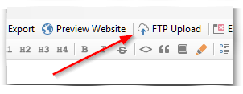

# FTP Upload

The FTP upload function allows you to upload every change of your website to your webspace. Only changed and new files are uploaded. Just click the button "FTP upload" to start the upload. DA-HelpCreator takes care of the rest.